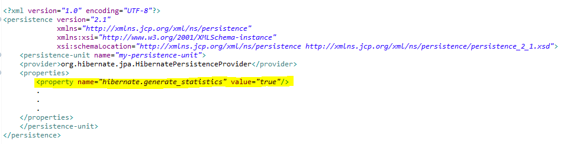
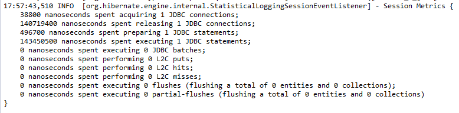

## Encontrando problemas de desempenho com Hibernate Statistics

Encontrar ineficiências em um sistema que utiliza Hibernate pode ser um pouco difícil pois os SQLs gerados geralmente ficam ocultos e com isso não conseguimos identificar ineficiências.

Encontrar os problemas de desempenho em um sistema é importante porém na maioria das vezes não é fácil.

Geralmente estes problemas são causados por algumas pequenas ineficiências que não são visíveis.

Embora os problemas de desempenho sejam difíceis de encontrar em seu sistema de teste, você ainda poderá ver as ineficiências, se observar algumas estatísticas internas. 

Uma maneira de fazer isso é ativar o Hibernate Statistics seguindo os seguintes passos:

- No arquivo persistence.xml configurar a propriedade hibernate.generate_statistics como true, exemplo:

  

  

- Configurar o nível de log de *org.hibernate.stat* para *DEBUG*

O Hibernate coletará algumas estatísticas internas sobre cada sessão, como o número de consultas realizadas e o tempo gasto para elas ou o número de ocorrências e falhas de cache.

Um exemplo disso seria:

Isso é bem útil para testes onde podemos identificar o tempo gasto na execução de uma Query além ajudar a identificar se uma consulta em específico está tendo o típico [problema de n + 1](https://vladmihalcea.com/n-plus-1-query-problem/) pois as estatísticas mostram quantas querys foram preparadas e executadas para determinada consulta.

