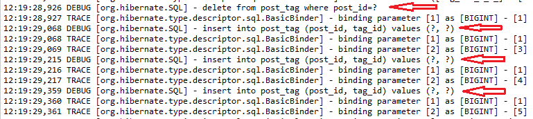
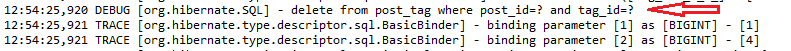

## Melhor forma de se utilizar a anotação @ManyToMany com JPA

É recomendado pelo comunidade o uso de **java.util.Set** no lugar **java.util.List** para coleções que contém um relacionamento de muitos para muitos.

Essa recomendação é devido a uma peculiaridade ocorrida durante a deleção de uma entidade que contém o relacionamento de muitos para muitos.

Para ilustrar o problema considere as seguinte entidades:

```java
@Entity(name = "Post")
@Table(name = "post")
public class Post {
 
    @Id
    @GeneratedValue
    private Long id;
 
    private String title;
 
    public Post() {}
 
    public Post(String title) {
        this.title = title;
    }
 
    @ManyToMany(cascade = {
        CascadeType.PERSIST,
        CascadeType.MERGE
    })
    @JoinTable(name = "post_tag",
        joinColumns = @JoinColumn(name = "post_id"),
        inverseJoinColumns = @JoinColumn(name = "tag_id")
    )
    private List<Tag> tags = new ArrayList<>();
 
    //Getters and setters omitidos por brevidade
 
    public void addTag(Tag tag) {
        tags.add(tag);
        tag.getPosts().add(this);
    }
 
    public void removeTag(Tag tag) {
        tags.remove(tag);
        tag.getPosts().remove(this);
    }
 
    @Override
    public boolean equals(Object o) {
        if (this == o) return true;
        if (!(o instanceof Post)) return false;
        return id != null && id.equals(((Post) o).getId());
    }
 
    @Override
    public int hashCode() {
        return 31;
    }
}
```


```java
@Entity(name = "Tag")
@Table(name = "tag")
public class Tag {
 
    @Id
    @GeneratedValue
    private Long id;
 
    @NaturalId
    private String name;
 
    @ManyToMany(mappedBy = "tags")
    private List<Post> posts = new ArrayList<>();
    
    public Tag() {}
 
    //Getters and setters omitidos por brevidade
    
    public Tag(String name) {
        this.name = name;
    }
 

    @Override
    public boolean equals(Object o) {
        if (this == o) return true;
        if (o == null || getClass() != o.getClass()) return false;
        Tag tag = (Tag) o;
        return Objects.equals(name, tag.name);
    }
 
    @Override
    public int hashCode() {
        return Objects.hash(name);
    }
}
```


Observe que estamos utilizando a interface **java.util.List** para representar nosso relacionamento de muitos para muitos.

Considerando o seguinte caso de teste:

```java
@Test
public void testeDelecao() {
		
	Long postId = TransactionUtil.doInJPA(() -> entityManagerFactory, entityManager -> {
	    Post post1 = new Post("JPA with Hibernate");
	    Post post2 = new Post("Native Hibernate");
		 
	    Tag tag1 = new Tag("Java");
	    Tag tag2 = new Tag("Hibernate");
	    Tag tag3 = new Tag("JPA");
	    Tag tag4 = new Tag("Hibernate + JPA");
		 
	    post1.addTag(tag1);
	    post1.addTag(tag2);
	    post1.addTag(tag3);
	    post1.addTag(tag4);
		 
	    post2.addTag(tag1);
		 
	    entityManager.persist(post1);
	    entityManager.persist(post2);
		 
	    return post1.getId();
	});
		
	TransactionUtil.doInJPA(() -> entityManagerFactory, entityManager -> {
	    Tag tag1 = new Tag("Java");
	    Post post1 = entityManager.find(Post.class, postId);
	    post1.removeTag(tag1);
	});
		
}
```

No caso de teste acima estamos utilizando a classe **TransactionUtil** do pacote maven [**hibernate-testing**]( https://mvnrepository.com/artifact/org.hibernate/hibernate-testing/5.2.2.Final ) para testar a criação de nossas entidades  e a deleção de uma entidade Tag associada a entidade Post.

Ao executarmos o caso de teste o mesmo criará as duas entidades **Post** na base de dados com suas respectivas **Tags**, após isso nosso teste irá remover uma entidade **Tag** de nosso primeiro **Post** criado.

O resultado dessa deleção pode ser acompanhado no trecho de log a seguir:



Observe que tivemos um comportamento inesperado, esperávamos que o Hibernate deletasse apenas a Tag nomeada como "Java" do primeiro **Post** porém o mesmo deletou o relacionamento de todos os posts da entidade e criou outras 3 instruções SQL de insert para inserir novamente os relacionamento removidos desnecessariamente.

Em um cenário pequeno isso pode não fazer tanta diferença mas imagine um cenário no qual a entidade possua um relacionamento com 1000 outras entidades, se isso ocorrer poderemos ter um grave problema de performance, além de termos outras 999 instruções SQL desnecessárias sendo executadas no banco.


Para corrigir isto basta apenas trocar a interface **java.util.List** para **java.util.Set** em nossas entidades **Post** e **Tag**, ao fazermos isso teremos o seguinte resultado ao executar o mesmo caso de teste:




Conforme vimos neste tópico devemos ter cuidado ao usar a interface **java.util.List** em relacionamentos do tipo muitos para muitos, o recomendado é utilizar a interface **java.util.Set** para estes relacionamento.
